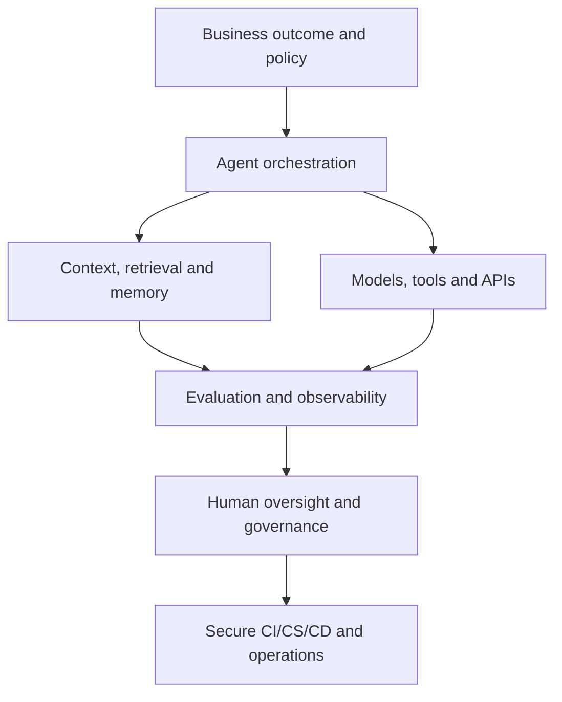

# Shankar Santhamoorthy

## AI-First Chief Technology Advisory | Indian Knowledge Systems Research | Traditional Knowledge Scholarship | Agentic AI | TechEd

**Technology advisory, AI-first engineering, Indian Knowledge Systems research, traditional-knowledge scholarship, teaching, training, and mentoring**

Chennai, India (IST) | Remote worldwide | On-site across India  
[Email](mailto:shankyvidhu@gmail.com) | [LinkedIn](https://www.linkedin.com/in/shankar-santhamoorthy-08b20356/) | [Blogger - Technology Insights](https://shankar-santhamoorthy-tech-insights.blogspot.com/) | [Blogger - IKS and Philosophy](https://shankar-whatisgod.blogspot.com/) | [GitHub](https://github.com/sankyvidhu) | Phone: +91 98843 36440

| Experience | Engagement | Base and reach | Academic practice |
| --- | --- | --- | --- |
| More than two decades in solution and enterprise architecture; 25+ years of independent IKS inquiry | Freelance, fractional, part-time, research, teaching, and scholarly collaboration | Chennai, India (IST); remote worldwide and on-site across India | Adjunct Professor of Practice, SSN Institutions; M.A. Saiva Siddhanta |

---

## Executive Profile

I work with founders, CTO offices, CXOs, and delivery organizations on the architecture decisions that determine whether an AI programme reaches production. I help organizations convert business strategy into secure, scalable, governable, and delivery-ready technology systems. My work combines **AI-first enterprise architecture**, **solution engineering**, **Agentic AI platform and harness engineering**, **Forward Deployment Engineering (FDE)**, **technology governance**, and **executive advisory**.

My career spans enterprise and solution architecture, digital transformation, cloud-native engineering, data platforms, DevSecOps, architecture governance, technical presales, technology alliances, and engineering leadership. I have worked with startups and large enterprises across AgriTech, education and publishing, banking and financial services, healthcare and life sciences, consumer goods, manufacturing, plant automation, and other technology-intensive domains.

In parallel, I work as an **Indian Knowledge Systems (IKS) researcher and traditional knowledge scholar**. My inquiry spans Saiva Siddhanta, Samkhya, Advaita Vedanta, comparative philosophy, Sanskrit and classical Tamil textual interpretation, sacred hermeneutics, iconography, and AI-enabled digital humanities. This is grounded in more than 25 years of independent study and an M.A. in Saiva Siddhanta. I distinguish canonical interpretation, comparative hypotheses, scientific analogy, and technical implementation so that interdisciplinary work remains traceable and open to review.

Three professional lines run in parallel: technology advisory and AI consulting; academic and corporate technology education; and IKS research, scholarship, curriculum, and digital-humanities collaboration. Alongside consulting, I serve as an **Adjunct Professor of Practice**, teaching and mentoring undergraduate and postgraduate students, advising technology laboratories and R&D initiatives, and helping learners connect rigorous theory with responsible practice.

### Value Proposition

- Translate business goals, regulatory obligations, and operational constraints into executable technology roadmaps.
- Design AI-first target architectures that integrate applications, data, cloud, security, APIs, events, and intelligent agents.
- De-risk Agentic AI through robust harnesses, evaluations, guardrails, observability, human oversight, and governance.
- Accelerate startup and enterprise presales with credible architecture, estimation, solution narratives, demonstrations, and delivery transition.
- Embed with delivery teams as a Forward Deployment Engineer to move from ambiguous requirements to working outcomes.
- Build internal capability through structured courseware, workshops, mentoring, architecture reviews, and hands-on laboratories.
- Conduct primary-text-led IKS research across Sanskrit and Tamil traditions with explicit sources, transliteration, conceptual mapping, and comparative analysis.
- Apply knowledge graphs, retrieval, multilingual AI, and digital-humanities methods to make traditional-knowledge corpora more discoverable, reviewable, and teachable.

---

## 1. Chief Technology Advisory and AI Consulting as a Service

### 1.1 AI-First Enterprise Architecture Consulting

I help leadership teams define how AI becomes a governed enterprise capability rather than an isolated proof of concept.

**Typical services**

- Business-capability, value-stream, application, data, technology, and security architecture assessment.
- AI opportunity discovery, use-case qualification, portfolio prioritization, and value/risk scoring.
- Current-state assessment and target-state architecture for AI-enabled enterprises.
- Technology strategy, platform strategy, modernization roadmap, and investment sequencing.
- Cloud, multi-cloud, hybrid-cloud, and cloud-native architecture across AWS, Microsoft Azure, and Google Cloud.
- Application modernization, legacy decomposition, API enablement, event-driven integration, and microservices strategy.
- Data platform, analytics, MLOps/LLMOps, knowledge, and retrieval-augmented generation architecture.
- Reference architectures, architecture principles, standards, reusable patterns, and engineering guardrails.
- Architecture Decision Records (ADRs), solution blueprints, non-functional requirements, risk registers, and governance checkpoints.
- Technology-product evaluation, vendor assessment, RFI/RFP support, and techno-commercial decision frameworks.
- Architecture Review Boards, design assurance, continuous architecture assessment, and technical-debt governance.

**Representative deliverables**

| Advisory output | Business purpose |
| --- | --- |
| Executive technology assessment | Establish a shared, evidence-based view of risks, gaps, and priorities |
| AI-first enterprise blueprint | Define how business, data, applications, agents, security, and infrastructure work together |
| Target-state architecture | Provide a coherent destination for product and platform teams |
| Transformation roadmap | Sequence initiatives by value, dependency, cost, risk, and readiness |
| Reference architectures and patterns | Improve consistency, reuse, security, and delivery velocity |
| Architecture governance model | Clarify decision rights, controls, exceptions, and measurable standards |
| RFP/RFI and vendor scorecard | Support objective technical and commercial selection |
| Executive decision paper | Present options, trade-offs, recommendations, and investment implications |

**Typical engagement pack:** architecture blueprint report, capability heat map, phased transformation roadmap, Architecture Decision Records, non-functional and scale model, and an independent techno-commercial comparison across AWS, Azure, and Google Cloud.

### 1.2 Agentic AI Harness Engineering Consulting

An AI agent is only as dependable as the engineering system around it. I advise and support teams in designing the **agent harness**: the orchestration, context, tools, memory, evaluation, safety, deployment, and operational controls that turn model capability into reliable business performance.

**Harness architecture and engineering scope**

- Agent roles, boundaries, task decomposition, state machines, workflow orchestration, and multi-agent coordination.
- Model abstraction, routing, fallback, cost/latency controls, structured outputs, and provider portability.
- Tool and API contracts, Model Context Protocol (MCP) integration, permission boundaries, and sandboxing.
- Context engineering: instructions, working context, retrieval, memory, compaction, provenance, and freshness controls.
- Prompt engineering: reusable templates, version control, test cases, prompt injection resistance, and change governance.
- Knowledge pipelines, semantic retrieval, hybrid search, re-ranking, citations, and source-grounding.
- Short-term, episodic, semantic, and durable memory patterns with privacy and retention policies.
- Agent evaluations: task success, groundedness, accuracy, safety, latency, cost, robustness, and human acceptance.
- Simulation, adversarial testing, red teaming, regression suites, and production canaries.
- Human-in-the-loop approvals, escalation routes, reversible actions, audit trails, and exception handling.
- Agent observability: traces, decisions, tool calls, token/cost telemetry, failure analysis, and operational dashboards.
- Secure deployment through CI/CS/CD, policy-as-code, secrets management, identity, least privilege, and runtime controls.
- LLMOps and AgentOps operating models for versioning, release management, incident response, and continuous improvement.

**Typical deliverables:** harness reference implementation, agent-capability contracts, evaluation-set design and scoring rubric, guardrail and policy specification, telemetry and trace schema, and token/cost/latency budget model.

### 1.3 Presales Architectural Consulting

I support product companies, IT-services firms, SaaS ventures, and internal platform teams that need senior architecture depth during discovery and sales without immediately adding a full-time executive role.

**Presales support**

- Opportunity qualification and technical discovery with business and technology stakeholders.
- Problem framing, assumptions, constraints, risks, and non-functional requirement discovery.
- Solution architecture, integration design, deployment topology, and security posture.
- Build-versus-buy-versus-partner analysis and technology/product selection.
- Estimation inputs, work breakdown, phased roadmaps, proof-of-value plans, and delivery risks.
- Architecture narratives for proposals, executive presentations, and customer workshops.
- Technical responses for RFI, RFP, due diligence, security questionnaires, and architecture reviews.
- Demonstration and proof-of-concept architecture, acceptance criteria, and evaluation scorecards.
- Deal-shaping, solution defensibility, value articulation, and handover from presales to delivery.
- Coaching for solution architects, sales engineers, product leaders, and founders.

**Typical deliverables:** solution-architecture pack, estimation and sizing model, risk and assumption register, proof-of-concept plan with exit criteria, proposal-defence deck, and preparation for CTO, CISO, CFO, and customer Q&A.

### 1.4 Forward Deployment Engineering Consulting and Governance

Forward Deployment Engineering closes the gap between a platform's generic capability and a client's real operating environment. I work alongside customer and product teams to understand the domain, configure or extend the solution, integrate it into the enterprise landscape, establish controls, and achieve measurable adoption.

**FDE responsibilities and outcomes**

- Embed with customers to discover workflows, data realities, constraints, and success criteria.
- Translate ambiguous needs into specifications, architecture decisions, prototypes, and incremental releases.
- Configure, integrate, and extend AI, data, API, workflow, and cloud platforms.
- Build thin vertical slices and proofs of value against representative business scenarios.
- Coordinate product engineering, security, data, operations, customer stakeholders, and vendors.
- Define production-readiness gates covering security, reliability, performance, supportability, and governance.
- Instrument adoption, quality, value, cost, and operational risk.
- Capture reusable patterns and feed field learning back into the core platform roadmap.
- Transfer knowledge to customer teams and establish a sustainable operating model.

**Typical deliverables:** deployment runbook, governance charter with explicit gate criteria, architecture-review scorecards, integration and interface contracts, release and rollback plan, and handover/enablement pack.

### 1.5 AI and Technology Governance

I help organizations establish proportionate governance that enables innovation while preserving accountability.

- AI principles, acceptable-use policies, risk taxonomy, and use-case classification.
- Accountability model and decision rights across business, technology, data, security, legal, risk, and audit.
- Model, prompt, knowledge, agent, tool, and data lifecycle controls.
- Privacy, intellectual-property, cybersecurity, third-party, and regulatory risk assessment.
- Human oversight, transparency, explainability, traceability, and evidence retention.
- Architecture conformance, threat modelling, red-team findings, exceptions, and remediation tracking.
- KPI/KRI frameworks for value, quality, safety, resilience, cost, adoption, and compliance.
- Responsible retirement, rollback, incident response, and post-incident learning.

---

## 2. Adjunct Professor and TechEd Consulting

Teaching is a standing part of my practice, not an aside. I lecture B.Tech. and M.Tech. computer-science cohorts at SSN Institutions, advise technology laboratories and R&D initiatives, and mentor industrial projects to a reviewable standard. I also design and deliver modular learning programmes for universities, corporate academies, engineering teams, founders, and technology leaders, using material grounded in live architecture and engineering practice.

### Teaching, Training, and Mentoring Portfolio

#### Secure Software Development Lifecycle (SSDLC)

- Requirements, architecture, design, implementation, verification, release, operations, and continuous improvement.
- Secure-by-design and privacy-by-design principles.
- Threat modelling, secure design review, dependency and software supply-chain hygiene, secrets management, secure coding, testing, assurance, and auditable delivery gates.
- Agile, product, platform, and enterprise delivery models.

#### Full-Stack Engineering

- Web and mobile architecture; client, API, services, integration, data, and cloud tiers.
- JavaScript/TypeScript, React-oriented front ends, Node.js services, REST/GraphQL APIs, and data persistence.
- API design, state and caching strategy, edge/offline behaviour, Domain-Driven Design (DDD), microservices, event-driven architecture, and integration patterns.
- Testing strategy, performance, resilience, security, observability, and deployment.

#### Data Engineering

- Polyglot and multi-model storage selected by content type and access pattern; SQL/NoSQL, lakehouse/warehouse concepts, batch, streaming, and event pipelines.
- Data quality, metadata, lineage, governance, orchestration, and platform observability.
- Analytics, feature pipelines, vector/semantic data, and AI-ready data products.

#### Agentic AI and Harness Engineering

- Building the production harness rather than only the demonstration: agent architecture, orchestration, tool interfaces, MCP, retrieval, memory, and context management.
- Evaluation-driven development, safety testing, red teaming, AgentOps, and governance.
- Hands-on design of reliable workflows, tracing, guardrails, enterprise integration patterns, and cost/failure characteristics.

#### DevSecOps

- Pipeline-native security, policy as code, vulnerability and patch discipline, secrets, and software supply-chain security.
- Container and Kubernetes cluster hardening, infrastructure as code, observability, and audit evidence.
- Operating models that keep information security and engineering aligned throughout delivery.

#### CI/CS/CD

- Continuous Integration, Continuous Security, Continuous Delivery, and Continuous Deployment as one governed path.
- Trunk and branch hygiene, build/test automation, test strategy and pyramid, artifact management, and environment promotion.
- Progressive delivery, deployment telemetry, release and rollback, incident response, and operational feedback loops.

#### Spec-Driven Development (SDD)

- Writing the specification as a primary engineering artifact: functional and non-functional requirements, acceptance criteria, examples, invariants, interface contracts, and traceability.
- Specifications as verifiable inputs to architecture, human- or AI-assisted implementation, code generation, tests, reviews, and release evidence.
- Human-AI collaboration patterns for controlled generation and validation.

#### Context Engineering

- Deciding what a model should see and when: retrieval design, context assembly and compaction, memory boundaries, grounding sources, provenance, and token-budget management.
- Measuring which context improves task outcomes; freshness, relevance, privacy, and retention controls.

#### Prompt Engineering

- Prompt structure and instruction hierarchy, role/task definition, few-shot patterns, tool-use framing, structured outputs, and schema enforcement.
- Evaluation-driven iteration, regression testing, prompt security, injection defence, versioning, observability, and governance.

### TechEd Deliverables

- Curriculum and competency frameworks.
- Detailed courseware, instructor guides, learner workbooks, and reference notes.
- Presentations, demonstrations, case studies, architecture diagrams, and code laboratories.
- Assessments, question banks, rubrics, project briefs, and capstone evaluation.
- Faculty enablement and train-the-trainer programmes.
- One-to-one mentoring, cohort mentoring, architecture clinics, and project reviews.
- Academic R&D lab advisory and industry-aligned innovation roadmaps.

### Formats and Audiences

| Formats | Audiences |
| --- | --- |
| Semester lectures; short corporate cohorts with hands-on labs; technology-lab and R&D advisory; industrial-project and capstone mentoring; curriculum/content design; architecture-review clinics | Engineering undergraduates and postgraduates; early-career engineers moving into architecture; established platform/data teams adopting agentic workflows; startup squads without a senior architect in-house |

---

## 3. Indian Knowledge Systems Research and Traditional Knowledge Scholarship

My IKS work brings together primary-text study, traditional commentarial methods, comparative philosophy, teaching, and responsible digital-humanities engineering. It is a parallel scholarly practice—not a replacement for my technology career—and it benefits from the same disciplines of traceability, architecture, knowledge representation, evaluation, and governance.

**Featured project:** [Indian Knowledge Systems Research and Digital Humanities](https://github.com/sankyvidhu/indian-knowledge-systems-research)

### 3.1 Research Identity and Method

- **25+ years of continuous independent inquiry** into Indian philosophy, sacred literature, metaphysics, cosmology, and traditional knowledge.
- **M.A. in Saiva Siddhanta**, supported by study of the Meykandar Shastras, Tirumurais, Saiva Agamas, and related Tamil traditions.
- Sanskrit philosophical terminology, etymological analysis, textual comparison, and commentary-led interpretation.
- Classical Tamil study spanning Sangam literature, the Saiva Tirumurais, *Tirumantiram*, devotional poetry, and modern spiritual commentary.
- Comparative analysis across Astika and Nastika traditions, Western philosophy, modern science, and cognitive systems.
- Clear separation of canonical claims, commentarial positions, original synthesis, scientific analogy, and research hypotheses.

### 3.2 Core IKS Specializations

| Specialization | Research focus |
| --- | --- |
| **Samkhya Darshana** | *Samkhyakarika*, *Samkhyatattvakaumudi*, *Samkhyapravacanasutra*, *Tattvasamasa*, *Yuktidipika*, tattva systems, Purusha-Prakriti, Triguna, Satkaryavada, Parinamavada, and the three pramanas |
| **Advaita Vedanta and comparative philosophy** | Kevaladvaita, Vivartavada, Maya/Avidya, the Shaddarshanas, Buddhist and Jain perspectives, Kantian epistemology, and phenomenology |
| **Saiva Siddhanta and classical Tamil traditions** | *Sivajnanabodham*, the fourteen Meykanda Shastras, *Tirumantiram*, *Tevaram*, *Tiruvacagam*, *Kandapuranam*, and Tamil devotional literature |
| **Vallalar and Suddha Sanmarga** | Jivakarunyam, spiritual compassion, mystical transformation, sacred poetry, and the philosophical vision of Ramalinga Vallalar |
| **Sacred hermeneutics and iconography** | Murugan metaphysics, Arupadaiveedu, Kundalini symbolism, the Vel, Nataraja, Ananda Tandava, Chidambaram, Ardra Darshanam, and sacred architecture |
| **Comparative science and metaphysics** | Carefully bounded comparison of traditional cosmology with thermodynamics, quantum theory, cognition, systems thinking, and philosophy of science |
| **Digital humanities for IKS** | Multilingual corpora, concordances, knowledge graphs, retrieval, provenance, semantic search, contradiction analysis, research notebooks, and AI-assisted textual inquiry |

### 3.3 Long-Form Research Corpus

My principal long-form research programme is *Kim Tat Brahma* ("What is that Ultimate Reality?"), an eight-volume research corpus described in the source dossier as exceeding 3,000 pages and developed over approximately three decades. It investigates classical Indian accounts of reality, knowledge, consciousness, causality, manifestation, and liberation across multiple philosophical schools.

The corpus develops an original integrative formulation—*Anekavima Suddhakevaladvaita Ekatva*—as a research thesis for comparing plural philosophical standpoints. This work is presented as an ongoing scholarly synthesis rather than as established scientific consensus.

### 3.4 AI-Enabled IKS and Digital Humanities

I have conceptualized an intelligent, multimodal research workbench for Indian Knowledge Systems that brings together curated texts, manuscript and academic repositories, multilingual models, concordance, provenance, and comparative analysis.

**Research-platform scope**

- Source ingestion with edition, language, translator, commentator, and provenance metadata.
- Sanskrit, Tamil, transliteration, translation, and terminology alignment.
- Passage-level citation, parallel-text comparison, semantic retrieval, and knowledge-graph navigation.
- School, text, commentator, concept, argument, and contradiction mapping.
- Human-reviewed AI assistance for summarization, cross-reference, question answering, and research-note generation.
- Evaluation for citation accuracy, faithfulness, translation quality, doctrinal attribution, and uncertainty.
- Research notebooks and interactive knowledge spaces for Samkhya, Vedanta, Saiva Siddhanta, Tamil metaphysics, and comparative inquiry.

### 3.5 Publications, Research Portals, and Lectures

**Published monograph**

- [*Muruga! Let Your Glory Be Extolled*](https://whatisgod-tirumurgan.blogspot.com/2025/10/muruka-perumaiperu-ninatupukal.html) — a Tamil monograph on Murugan worship, literature, metaphysics, theology, and yogic interpretation; published through Notion Press and listed through Indian booksellers in 2024.

**Specialized research portals**

- [Samkhya Darshana](https://whatisgod-samkhya.blogspot.com/) — course modules, literature reviews, and shastric commentary.
- [Tiru Murugan](https://whatisgod-tirumurgan.blogspot.com/) — Skanda-Murugan theology, metaphysics, literature, and sacred symbolism.
- [Ramalinga Vallalar](https://whatisgod-iraamalingavallalaar.blogspot.com/) — Suddha Sanmarga, poetry, compassion, and mystical transformation.
- [Philosophical Traditions of Hinduism](https://shankar-whatisgod.blogspot.com/) — cross-darshana and comparative philosophical inquiry.
- [Navaratra and Dasahara Upasana](https://whatisgod-navaratradashahara.blogspot.com/) — Devi worship and festival hermeneutics.
- [Citsabhesamangalam](https://chitsabhesayamangalam.blogspot.com/) — Chidambaram, Nataraja iconography, sacred architecture, and celestial alignment.
- [Vidvesha Bhakti](https://whatisgod-vidveshabhakti.blogspot.com/) — adversarial devotion and its psycho-spiritual interpretation.
- [Sanatana Dharma Studies](https://whatisgod-sanathanadharma.blogspot.com/) — cosmology, Puranic time, and Vedic epistemology.

**Selected video lectures**

- [What is God / Bharatiya Sanatanadharma](https://www.youtube.com/watch?v=0PjT9LmtBOY) — scripture, religion, and inquiry into ultimate reality.
- [Introduction to Samkhya Philosophy](https://www.youtube.com/watch?v=-Ealpudu3Pg) — lineage, chronology, and textual corpus.
- [Trigunatmakam in Samkhya](https://www.youtube.com/watch?v=VdOmg8NwiH0) — epistemological, ontological, and scriptural analysis of the three gunas.

### 3.6 IKS Research, Education, and Collaboration Offerings

- Primary-text research, literature review, annotated bibliography, and comparative concept mapping.
- IKS curriculum, courseware, faculty enablement, lectures, workshops, and learner mentoring.
- Digital archive, taxonomy, ontology, knowledge graph, semantic retrieval, and research-platform architecture.
- Multilingual AI and Agentic AI harness design for source-grounded IKS research.
- Research-method review covering attribution, transliteration, translation, provenance, uncertainty, and responsible comparison.
- Scholarly collaboration with universities, Indic-study centres, digital-humanities teams, publishers, cultural institutions, and responsible-technology programmes.

---

## 4. Industry Verticals and Micro-Verticals

My approach combines reusable architecture patterns with the workflows, risks, data, regulation, and economics of each industry.

| Industry vertical | Illustrative micro-verticals | AI-first and technology advisory focus |
| --- | --- | --- |
| **EduTech and education publishing** | K-12 platforms, higher-education LMS/LXP, assessment and proctoring, academic publishing, skilling and certification, research labs | Adaptive learning, content intelligence, student services, assessment integrity, learning analytics, knowledge assistants, academic platforms, lab and R&D advisory |
| **AgriTech and food supply chain** | Farm-to-fork supply chains, agri-input commerce, cold-chain logistics, farmer advisory, grading and quality, warehousing and distribution | Supply/demand intelligence, IoT integration, traceability, route and inventory optimisation, partner platforms, AI-assisted operations |
| **Media, Publishing, and Entertainment (IME)** | Trade and academic publishing, newsrooms/content operations, OTT and streaming, rights and royalties, advertising and ad-tech | Content supply chains, CMS/DAM, metadata, semantic search, rights workflows, subscriptions, personalisation, GenAI-assisted content with provenance and editorial controls |
| **Banking, Financial Services, and Insurance (BFSI)** | Retail and corporate banking, payments and lending, capital-markets operations, underwriting and claims, wealth, risk, and RegTech | Enterprise modernisation, customer and operations platforms, fraud/risk analytics, document intelligence, governed AI assistance, resilient integration, data and regulatory controls |
| **Healthcare and Life Sciences** | Provider systems and EMR integration, payer claims, clinical-trial data, pharma commercial operations, diagnostics and laboratories | Secure data platforms, interoperability, knowledge and workflow assistance, document intelligence, research support, traceability, privacy, safety, and human oversight |
| **Retail and fast-moving consumer goods** | Omnichannel commerce, merchandising and pricing, catalogue, warehouse and last mile, loyalty and CRM | Customer intelligence, recommendations, conversational commerce, catalogue enrichment, demand/inventory optimisation, intelligent service, and composable commerce |
| **Manufacturing and plant automation** | Industry 4.0 and IIoT, MES-to-ERP integration, predictive maintenance, digital twins, plant analytics and quality | IoT/edge integration, predictive insights, digital operations, quality intelligence, maintenance assistance, cloud/data modernisation, and AR/VR enablement |
| **Technology, SaaS, and IT services** | Startups, product engineering, platforms, managed services, internal developer platforms | Product and platform architecture, presales, multi-tenancy, API ecosystems, developer experience, Agentic AI harnesses, cloud economics, governance, and scale readiness |
| **IKS, cultural heritage, and digital humanities** | Universities, Indic-study centres, archives, publishers, museums, temples, research groups, and cultural institutions | Multilingual corpora, scholarly knowledge graphs, semantic retrieval, digital archives, source-grounded AI, provenance, curriculum, and research workbenches |

### Service Coverage by Industry

**Core** means direct delivery experience in the vertical. **Selective** means engagement on a defined scope or with a partner team.

| Vertical | AI-first EA | Agentic harness | Presales architecture | FDE and governance | TechEd |
| --- | --- | --- | --- | --- | --- |
| EduTech and education publishing | Core | Core | Core | Selective | Core |
| AgriTech and food supply chain | Core | Core | Selective | Core | Selective |
| Media, publishing, and entertainment | Core | Core | Core | Selective | Selective |
| BFSI | Core | Core | Core | Core | Selective |
| Healthcare and life sciences | Core | Selective | Core | Core | Selective |
| Retail and FMCG | Core | Core | Selective | Core | Selective |
| Manufacturing and plant automation | Core | Selective | Selective | Core | Selective |

---

## 5. Engagement Models and Availability

**Part-time by design. Scope, decision rights, commitment, deliverables, and acceptance criteria are agreed before work starts.**

| Model | Typical commitment | Best suited for |
| --- | --- | --- |
| **Advisory retainer** | 8-16 hours per week, contracted monthly | Continuing architecture coverage for a CTO office or founding team: reviews, decisions, mentoring, and escalations |
| **Architecture and strategy sprint** | 2-6 weeks, fixed scope | A blueprint, assessment, Agentic AI harness design, cloud comparison, or transformation decision with dated deliverables |
| **Forward-deployed engagement** | 2-3 days per week, per deployment | First production deployment of an AI/platform initiative, embedded with the customer's engineers |
| **Presales and deal support** | On call, per pursuit | Named opportunities requiring discovery, solution shaping, estimation, architecture defence, and delivery handover |
| **Fractional Chief Technology Advisor / CTO / Chief Architect** | Part-time, rolling monthly | Startups and growing enterprises needing senior technology leadership, hiring input, governance, and vendor/investment decisions without a full-time hire |
| **Independent architecture review** | Fixed-scope review | Programmes seeking an objective fitness assessment, risk/gap analysis, and prioritised remediation roadmap |
| **Workshop or bootcamp** | Per workshop or cohort | Teams needing accelerated capability development through laboratories, case studies, assessment, and an action plan |
| **Academic and training engagement** | Per cohort or semester | Universities and corporate academies commissioning one or more of the nine teaching tracks |
| **IKS research and digital-humanities collaboration** | Fixed-scope study, research sprint, course, or institutional programme | Primary-text research, curriculum, annotated corpora, knowledge architecture, multilingual retrieval, and source-grounded AI for traditional knowledge |

**Availability:** Part-time throughout, to roughly 20 hours per week across concurrent engagements. I typically accommodate up to two advisory retainers and one teaching engagement at a time; new work is scheduled around confirmed commitments.

---

## 6. Delivery and Research Approach

1. **Discover** - clarify business outcomes, users, workflows, constraints, risks, data, and current-state architecture.
2. **Frame** - define the problem, success measures, principles, requirements, assumptions, and decision criteria.
3. **Design** - create options, target architecture, integration and security models, guardrails, and delivery increments.
4. **De-risk** - test the highest-risk assumptions through proof, evaluation, threat modelling, cost analysis, and operational readiness.
5. **Deliver and govern** - support implementation, architecture decisions, quality gates, telemetry, and stakeholder alignment.
6. **Enable and transfer** - document reusable patterns, mentor teams, establish the operating model, and transfer ownership.
7. **Source and attribute** - for IKS work, record editions, passages, translators, commentators, terminology, provenance, and interpretive status.
8. **Compare responsibly** - separate textual interpretation and philosophical analogy from empirical scientific claims, and state uncertainty explicitly.

---

## 7. Technology and Research Depth

**Hands-on engineering and architecture coverage, not survey-level familiarity.**

**AI and data:** Agentic AI, generative AI, retrieval-augmented generation, knowledge systems, MLOps/LLMOps/AgentOps, analytics, data engineering, data warehouses and BI, relational and NoSQL databases, streaming and event platforms.

**Cloud and runtime:** AWS, Microsoft Azure, Google Cloud, hybrid and multi-cloud, Docker, Kubernetes on AKS/EKS/GKE, Istio service mesh, Apigee and NGINX API gateways, CDN/edge caching, Citrix and VMware virtualisation, platform engineering, infrastructure as code, and cloud governance.

**Application, engineering, and integration:** Web and mobile systems, JavaScript/TypeScript, Java, C/C++, PHP, Perl and shell scripting, J2EE and integration stacks, APIs, microservices, event-driven architecture, messaging, enterprise applications, application/web servers, content-management systems, version control, continuous integration, application performance management, and code assessment.

**Data and streaming technologies represented in prior work:** PostgreSQL, MySQL, Microsoft SQL Server, Oracle, Sybase, MongoDB Atlas, DataStax Cassandra, Apache Kafka, RabbitMQ, JMS, MSMQ, big-data and DWBI platforms, and data-science/MLOps pipelines across hybrid GPU and CPU estates.

**Security, governance, and architecture practices:** SSDLC, DevSecOps, CI/CS/CD, information security, cyber-security and vulnerability governance, ITIL operations, API security, observability, resilience, TOGAF-aligned enterprise architecture, capability and portfolio mapping, cloud assessment, reference architectures, DDD, microservices, event-driven architecture, product roadmaps, Architecture Decision Records, Architecture Review Boards and gate models, and vendor/Big Four partner management.

**IKS and digital-humanities methods:** Sanskrit and Tamil terminology alignment, transliteration, commentary comparison, canonical cross-referencing, hermeneutics, comparative philosophy, provenance-rich corpora, taxonomy and ontology design, knowledge graphs, semantic retrieval, multilingual AI, citation-grounded generation, and human-reviewed research workflows.

---

## 8. Selected Career and Research Evidence

- **Freelance Enterprise and Solution Architecture Advisory (2024-present):** technology advisory, implementation support, product-engineering and business-development consulting for startup and growth-stage organizations.
- **Adjunct Professor of Practice, SSN Institutions (2025-present):** professional teaching for B.Tech. and M.Tech. computer-science learners, industrial-project mentoring, and technology-lab/R&D advisory.
- **Independent IKS research and traditional-knowledge scholarship (25+ years):** sustained study of Samkhya, Advaita Vedanta, Saiva Siddhanta, classical Tamil sacred literature, comparative metaphysics, iconography, and digital-humanities applications.
- **IKS writing and public scholarship:** an eight-volume long-form research corpus in development; a published Tamil monograph on Murugan; specialized Blogger research portals; and recorded lectures on Sanatana Dharma, Samkhya, and Triguna theory.
- **Chief Technology Advisory assignments:** part-time advisory support for product engineering and business development, including Yakkay Technologies and ServeMind Technologies.
- **WayCool / Censanext (2021-2023):** Enterprise Architecture Advisor and General Manager - Chief Architect; supported multi-cloud evaluation, C-suite and engineering alignment, application and data transformation, polyglot data architecture, event-driven microservices, MLOps pipelines, Kubernetes, and multi-tenancy strategy.
- **Cognizant (2013-2019):** Principal Architect; delivered enterprise-architecture consulting for education publishing and banking, created regional architecture blueprints, advised application portfolios, provided reference patterns and design assurance, and contributed as a technology evangelist and trainer.
- **HCL Technologies (2000-2013):** Solutions Architect; contributed to large-scale solution engineering and enterprise delivery.
- **Earlier software-engineering roles (1995-2000):** programming and systems experience with HMA Data Systems, Bhari Information Technology, and Ramco Systems.
- Led and supported cross-functional engineering groups of **50+ team members** and worked across C-suite, product, programme, engineering, data, security, infrastructure, vendor, and partner stakeholders.
- Supported alliances and solution engagements involving major cloud ecosystems, including AWS, Microsoft, and Google.

---

## 9. Education, Languages, and Professional Credentials

- **TOGAF Certification**
- **Post Graduate Diploma in Software Engineering (GNIIT)**
- **Master of Arts in Saiva Siddhanta** — formal study of Saiva philosophical and canonical traditions
- **Bachelor of Commerce**
- **Research languages and textual practice:** Sanskrit philosophical terminology and textual comparison; classical and modern Tamil sacred and philosophical literature; English academic and technical communication

This combination of technology, business, architecture, teaching, and philosophical study informs a systems-oriented consulting style: rigorous about engineering detail, attentive to organizational context, and focused on responsible long-term outcomes.

---

## 10. Questions I Help Clients and Research Partners Answer

- Where should AI create measurable value in our enterprise, and what should we avoid?
- What target architecture will let us scale AI safely across business units?
- How should we design an Agentic AI harness that is testable, observable, secure, and governable?
- Which platform, cloud, model, database, integration, or vendor option best fits our constraints?
- How do we modernize legacy systems without destabilizing operations?
- How do we move from a demonstration to a production-grade, adopted capability?
- How should architecture governance work without slowing delivery?
- How can a startup make its technical proposition credible to enterprise buyers and investors?
- How can we establish an FDE capability that connects product engineering with customer outcomes?
- How do we upskill engineers, architects, faculty, or students for AI-first software delivery?
- How can an IKS corpus be digitized, attributed, searched, compared, and taught without losing textual provenance or doctrinal context?
- How should multilingual AI support Sanskrit and Tamil research while keeping citations, translations, interpretations, and uncertainty visible?
- How can traditional knowledge and modern scientific or technological frameworks be compared rigorously without collapsing one into the other?

---

## 11. Engagement and Research Principles

- **Business outcome before technology novelty**
- **Architecture as decisions and evidence, not diagrams alone**
- **Security, privacy, safety, and governance by design**
- **Evaluation-driven AI engineering**
- **Open standards, portability, and explicit trade-offs**
- **Incremental delivery with measurable learning**
- **Documentation, mentoring, and client capability transfer**
- **Independent advice with transparent assumptions and risks**
- **Primary-text fidelity, attribution, provenance, and interpretive transparency**
- **Respectful pluralism across Indian philosophical and knowledge traditions**
- **Clear boundaries between scripture, commentary, original synthesis, scientific analogy, and empirical evidence**

---

## Writing and Knowledge Sources

- [Technology Insights](https://shankar-santhamoorthy-tech-insights.blogspot.com/) — technology perspectives and professional reflections.
- [Philosophical Traditions of Hinduism and Comparative Inquiry](https://shankar-whatisgod.blogspot.com/) — the principal gateway to my IKS and philosophical writing.
- The specialized IKS portals listed above provide deeper research trails for Samkhya, Murugan, Vallalar, Navaratra, Chidambaram, Vidvesha Bhakti, and Sanatana Dharma.

---

## Start a Conversation

**The first call is a scoping call: no charge and no deck.**

I welcome conversations with founders, CTO offices, CXOs, product leaders, enterprise architects, engineering leaders, delivery organizations, universities, Indic-study centres, digital-humanities groups, publishers, cultural institutions, and innovation teams seeking senior, practical support for AI-first transformation, IKS research, and capability building.

**Available for:** freelance consulting, fractional leadership, part-time advisory, architecture reviews, presales engagements, Forward Deployment Engineering, IKS research collaboration, digital-humanities architecture, workshops, adjunct teaching, curriculum design, mentoring, and R&D-lab advisory.

[Email](mailto:shankyvidhu@gmail.com) | [LinkedIn](https://www.linkedin.com/in/shankar-santhamoorthy-08b20356/) | [Blogger - Technology Insights](https://shankar-santhamoorthy-tech-insights.blogspot.com/) | [Blogger - IKS and Philosophy](https://shankar-whatisgod.blogspot.com/) | [GitHub](https://github.com/sankyvidhu) | Phone: +91 98843 36440
